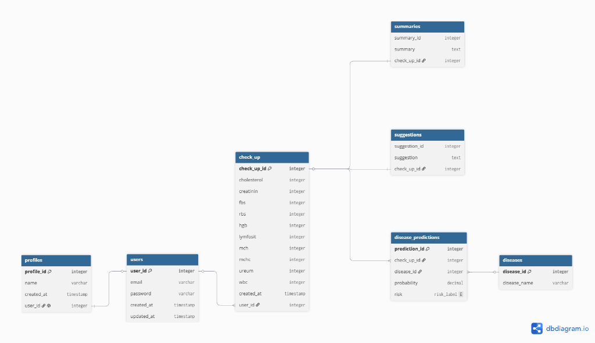

# Mirai | CAPSTONE PROJECT 2025

## 💎 Deskripsi Proyek

**Mirai** adalah platform berbasis Data Science dan Artificial Intelligence yang dikembangkan untuk membantu masyarakat memahami kondisi kesehatan mereka melalui hasil pemeriksaan laboratorium (_medical check-up_).

Proyek ini berfokus pada integrasi data hasil laboratorium dan data pemeriksaan dokter untuk mengidentifikasi pola risiko kesehatan menggunakan pendekatan Machine Learning. Sistem dirancang sebagai alat bantu analisis yang dapat memberikan indikasi risiko penyakit berdasarkan hasil tes laboratorium yang umum dilakukan saat medical check-up.

Kategori risiko yang menjadi fokus utama dalam proyek ini meliputi:

- Penyakit Jantung dan Pembuluh Darah
- Gangguan Metabolisme (Penyakit Dalam)
- Penyakit Paru-Paru

Sistem ini tidak dimaksudkan sebagai alat diagnosis medis, melainkan sebagai alat bantu analisis dan edukasi kesehatan berbasis data.

---

## 🎥 Demo

**Demo Video:**  
[Diisi Divisi Fullstack]

**Live Demo:**  
[Diisi Divisi Fullstack]

---

## 🚀 Fitur Utama

### 🩺 Health Risk Assessment

Menganalisis hasil laboratorium pasien untuk mengidentifikasi pola risiko kesehatan berdasarkan model Machine Learning.

### 📊 Medical Check-Up Dashboard

Menampilkan hasil pemeriksaan laboratorium dan informasi kesehatan secara visual dan mudah dipahami.

### 🤖 AI Risk Prediction

Memberikan prediksi kategori risiko kesehatan berdasarkan data laboratorium yang dimasukkan pengguna.

### 📈 Health Data Analytics

Melakukan analisis terhadap parameter laboratorium seperti:

- Cholesterol Total
- Creatinin
- Fasting Blood Sugar (FBS)
- Random Blood Sugar (RBS)
- Hemoglobin (HGB)
- Lymphocyte Percentage
- MCH
- MCHC
- MCV
- Ureum
- White Blood Cell (WBC)

## 👥 Role & Kontribusi Tim

| 👩‍💻 Nama                         | 🆔 Student ID  | 🎓 Learning Path | Kontribusi / Task                                                                                                                                                                    |
| :------------------------------ | :------------- | :--------------- | :----------------------------------------------------------------------------------------------------------------------------------------------------------------------------------- |
| **Husni Nur Dzaki**             | CDCC183D6Y0760 | Data Science     | Data preprocessing, data integration, feature engineering, feature selection, medical dataset construction, model evaluation, dan dokumentasi machine learning.                      |
| **Tamariska Pusparani**         | CDCC008D6X0992 | Data Science     | lorem ipsum dolor sit amet, consectetur adipiscing elit, sed do eiusmod tempor incididunt ut labore et dolore magna aliqua.                                                          |
| **Jati Sri Pamungkas**          | CFCC183D6Y2824 | Full-Stack       | Merancang & mengimplementasikan antarmuka pengguna (UI/UX) website, mendesain skema arsitektur database, serta melakukan integrasi sistem backend dengan model AI secara end-to-end. |
| **Arundaya Xenia Naurachmawan** | CFCC183D6X1944 | Full-Stack       | lorem ipsum dolor sit amet, consectetur adipiscing elit, sed do eiusmod tempor incididunt ut labore et dolore magna aliqua.                                                          |
| **Muhammad Alif Indrastata**    | CACC183D6Y2083 | AI               | lorem ipsum dolor sit amet, consectetur adipiscing elit, sed do eiusmod tempor incididunt ut labore et dolore magna aliqua.                                                          |

---

## 🕵️‍♂️ Informasi Repository

**Repository Utama:** https://github.com/husnindz/Mirai - Mirai

---

## 🧩 Full-Stack

| Teknologi / Library | Fungsi                                                                                                               |
| :------------------ | :------------------------------------------------------------------------------------------------------------------- |
| **HTML**            | Menyusun kerangka dan struktur dasar halaman web (seperti halaman Login, Dashboard, dan Detail Riwayat).             |
| **CSS**             | Mengatur tata letak visual, warna, estetika dekorasi, dan gaya dasar antarmuka pengguna.                             |
| **Javascript**      | Mengelola logika interaktif di sisi klien (frontend) dan manipulasi data dinamis secara real-time.                   |
| **React**           | Framework/Library UI untuk membangun komponen antarmuka yang modular, reaktif, dan berbasis Single Page App.         |
| **Tailwind**        | Framework utility CSS untuk mendesain antarmuka modern yang responsif dengan cepat langsung dari kelas HTML.         |
| **Express.js**      | Framework backend Node.js untuk menangani REST API, perutean data, logika bisnis, dan sistem autentikasi JWT.        |
| **PostgreSQL**      | Database relasional untuk menyimpan data akun pengguna, parameter tes lab, serta hasil prediksi AI secara aman.      |
| **Git**             | Sistem pengontrol versi (Version Control) untuk melacak perubahan kode dan mempermudah kolaborasi tim.               |
| **Vercel**          | Platform hosting cloud otomatis untuk mendeploy aplikasi frontend (React) dengan performa cepat dan integrasi SSL.   |
| **AWS**             | Layanan infrastruktur cloud (EC2 & RDS) sebagai server backend dan host database utama aplikasi secara online.       |
| **Docker**          | Teknologi kontainerisasi untuk membungkus backend dan model AI agar mudah dijalankan di VPS mana saja tanpa konflik. |

---

## 🧩 AI Engineer

| Teknologi / Library      | Fungsi                   |
| :----------------------- | :----------------------- |
| [Diisi Divisi Front-End] | [Diisi Divisi Front-End] |

---

## 🧩 Data Science

| Teknologi / Library | Fungsi                                              |
| :------------------ | :-------------------------------------------------- |
| **Pandas**          | Data cleaning, transformasi, dan integrasi dataset. |
| **NumPy**           | Komputasi numerik dan pengolahan array.             |
| **Scikit-Learn**    | Preprocessing dan feature engineering.              |
| **Matplotlib**      | Visualisasi data dan analisis hasil.                |
| **Streamlit**       | Dashboard interaktif untuk visualisasi data.        |

## 📈 Hasil yang Diharapkan

Proyek ini diharapkan dapat membantu:

- Meningkatkan kesadaran kesehatan masyarakat
- Memberikan indikasi awal risiko kesehatan
- Membantu interpretasi hasil medical check-up secara lebih mudah
- Mendukung pengambilan keputusan berbasis data dalam bidang kesehatan

---

## ⚙️ Panduan Menjalankan Proyek di Lokal

Mirai terdiri dari tiga modul utama yang saling terhubung: **Frontend (React)**, **Backend (Express)**, dan **AI Model Service (FastAPI)**. Anda dapat menjalankannya langsung di mesin lokal atau menggunakan Docker.

### 📋 Prasyarat (_Prerequisites_)

Pastikan Anda sudah menginstal:

- Node.js (v20 ke atas)
- Python (v3.10 ke atas) & `pip`
- PostgreSQL (v14 ke atas)
- Docker Desktop (Opsional - Jika ingin menjalankan lewat kontainer)

---

### 🚀 Cara Menjalankan Layanan Secara Manual (Lokal)

#### 1. AI Model Service (FastAPI)

1. Masuk ke direktori model:
   ```bash
   cd Full-Stack/model
   ```
2. Buat Virtual Environment & Aktifkan:
   - **Windows**:
     ```bash
     python -m venv venv
     .\venv\Scripts\activate
     ```
   - **macOS/Linux**:
     ```bash
     python3 -m venv venv
     source venv/bin/activate
     ```
3. Instal semua dependensi:
   ```bash
   pip install -r requirements.txt
   ```
4. Jalankan server FastAPI:
   ```bash
   uvicorn main:app --host 0.0.0.0 --port 8000 --reload
   ```

   - _Layanan akan aktif di: `http://localhost:8000`_

#### 2. Backend API Service (Express.js)

1. Masuk ke direktori backend:
   ```bash
   cd Full-Stack/backend
   ```
2. Instal semua dependensi Node:
   ```bash
   npm install
   ```
3. Konfigurasi Environment Variables:
   - Salin file `.env.example` menjadi `.env`:
     ```bash
     cp .env.example .env
     ```
   - Buka berkas `.env` lalu sesuaikan kredensial PostgreSQL dan tambahkan `GEMINI_API_KEY` Anda.
4. Jalankan database migrasi (opsional jika skema belum naik):
   ```bash
   npm run db:up
   ```
5. Jalankan backend server:
   ```bash
   npm run dev
   ```

   - _Layanan API akan aktif di: `http://localhost:3000`_

#### 3. Frontend Client (React)

1. Masuk ke direktori frontend:
   ```bash
   cd Full-Stack/frontend
   ```
2. Instal semua dependensi Node:
   ```bash
   npm install
   ```
3. Jalankan aplikasi web:
   ```bash
   npm run dev
   ```

   - _Aplikasi web akan aktif di: `http://localhost:5173`_

---

### 🐳 Cara Cepat Menjalankan Lewat Docker (Rekomendasi)

Jika ingin menjalankan seluruh ekosistem aplikasi secara instan dengan satu baris perintah menggunakan Docker Compose:

1. Pastikan Anda berada di direktori root proyek (yang memiliki file `docker-compose.yml`).
2. Jalankan perintah berikut:
   ```bash
   docker compose up --build -d
   ```
3. Docker akan otomatis mem-build kontainer untuk backend, frontend, dan AI model serta menyambungkannya dalam jaringan lokal.

---

## 🗄️ Skema Database

Berikut adalah representasi struktur basis data relasional (PostgreSQL) yang digunakan oleh aplikasi **Mirai**.



---

> ⚠️ Disclaimer:
>
> Sistem ini bukan alat diagnosis medis dan tidak menggantikan konsultasi dengan tenaga kesehatan profesional. Hasil yang diberikan hanya berupa prediksi berbasis data historis dan model machine learning.

---

_Copyright © 2025 Mirai Team_
